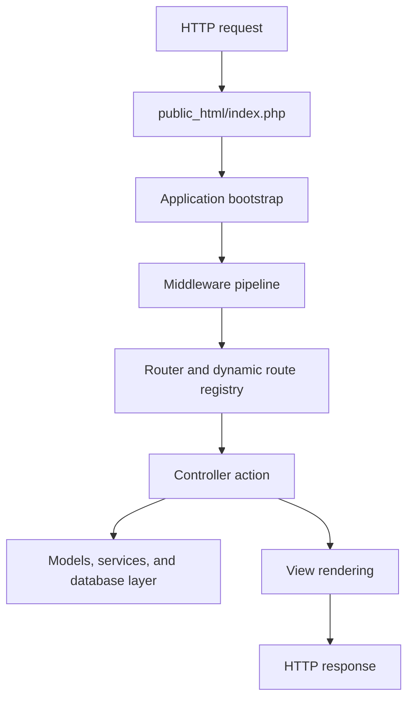

# Architecture Overview

## High-Level Structure

```text
.
├── app/
│   ├── bin/console
│   ├── bootstrap/
│   ├── core/
│   │   ├── cache/
│   │   ├── database/
│   │   ├── middleware/
│   │   ├── permissions/
│   │   ├── routing/
│   │   └── services/
│   ├── mvc/
│   │   ├── controllers/
│   │   ├── models/
│   │   └── views/
│   ├── routes/
│   └── storage/
├── public_html/
├── scripts/
└── docs/
```

## Request Lifecycle



## Core Concepts

- `public_html/` is the only web-exposed root.
- `app/bootstrap/` prepares runtime configuration and class loading.
- `app/core/` contains infrastructure services such as routing, middleware, cache, database, mail, and permissions.
- `app/mvc/controllers/` handles HTTP actions.
- `app/mvc/models/` represents application data and business entities.
- `app/mvc/views/` renders pages, admin screens, components, and emails.
- `app/routes/` defines route registration.
- `app/storage/` stores writable runtime artifacts such as cache, logs, uploads, and rate-limit data.

## Database and Content Model

The framework ships with migrations for users, pages, blog posts, categories, tags, roles, permissions, navigation menus, languages, API tokens, IP tracking, regions, and continents.

`schema_migrations` tracks applied migrations so `db:migrate` remains idempotent.

## Security Layers

- CSRF protection for state-changing requests
- Security headers and CSP nonce handling
- Rate limiting middleware
- Session/authentication hardening
- Role/permission authorization checks
- Centralized logging with sensitive-token masking

## Frontend Build

Vite builds frontend assets into `public_html/dist/`. Tailwind and PostCSS configuration live in the repository root, while backend rendering continues through PHP views.
